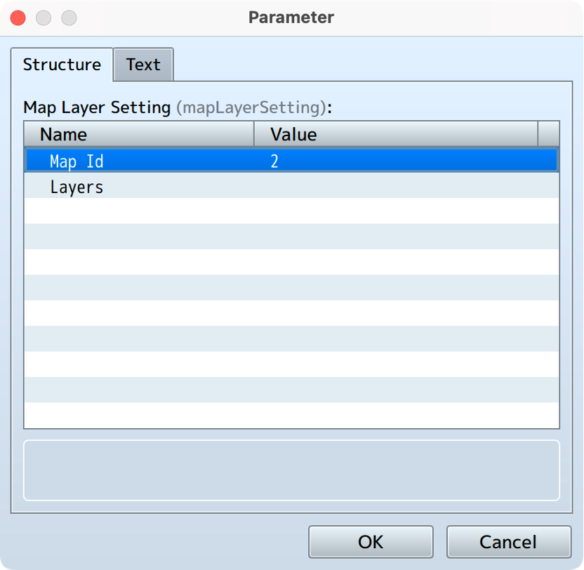
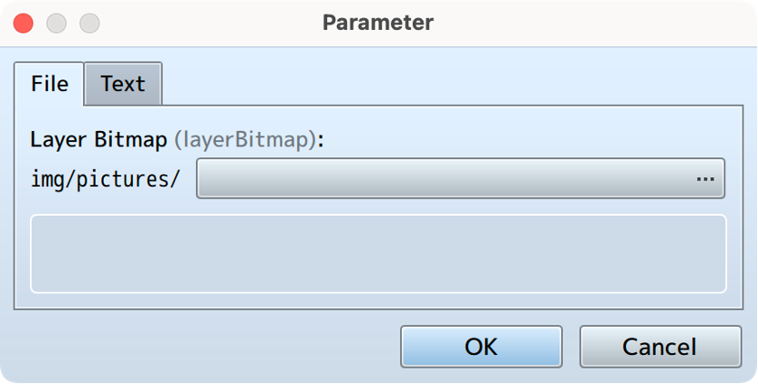
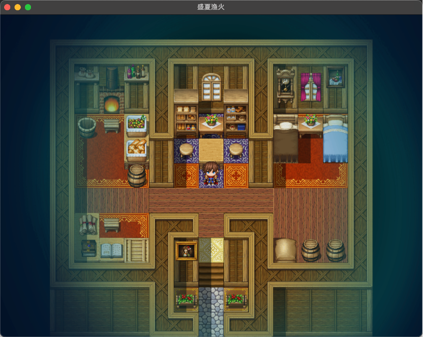
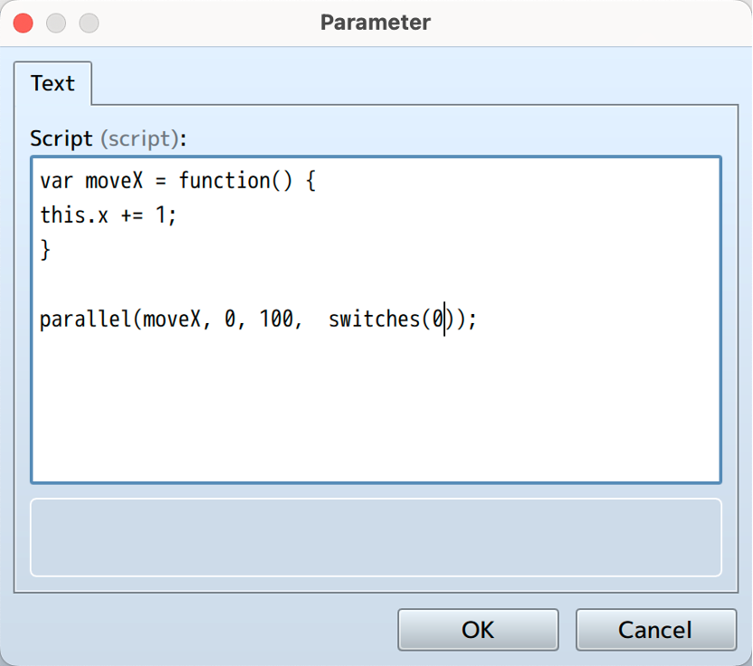
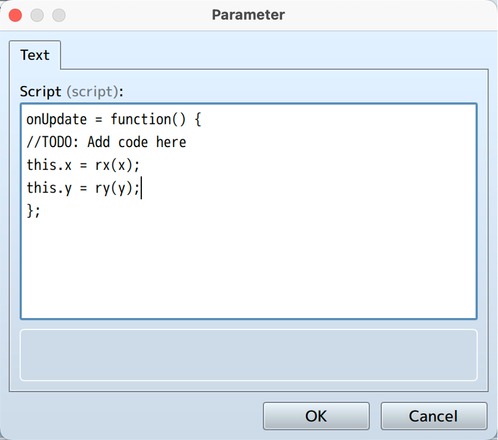

# 多图层系统（Multilayer System）

* ## 基本使用

    进入插件管理页面：

    

    双击Map Layer Setting打开列表，在这里可以进行对于不同的Map的配置，例如创建一份id为002的Map的多图层配置：

    

    此后，在Layer下设置的任何参数将会被应用到Map002，现在我们将一张png加载进Map002，双击Layers可以看到一份新的空列表，这个参数下的每个列表将代表一个图层，双击一个空行创建一个新的图层：

    

    

    可以看到有许多预设常用参数，这些参数被设置在了列表中以方便查看和使用。
    其中，第一行Layer Bitmap为必须参数，缺少这行参数将会出现错误，双击Layer Bitmap选中一张图片作为将要加载的位图：

    

    

    然后，确定保存，进入游戏相应地图查看：

    

    如图所示图像已经被正确加载了，但是下方有一条空白，似乎不太符合我们的预期。
    调整相关参数：

    

    

    以下是相关参数的说明：

    - Mode: 加载图层的模式，normal为普通模式，简单的显示图层；follow会自动将图层转换为地图坐标，与Tilemap具有类似的行为
    - X: X轴方向相对于Tilemap的偏移（Follow模式下），X轴位置（Normal模式下）
    - Y: Y轴方向相对于Tilemap的偏移（Follow模式下），Y轴位置（Normal模式下）
    - Z: 图层的Z轴，控制渲染时的层叠关系，Z轴大的显示在上方
        - RM中的的Z轴：
            - 图块：-1
            - 事件（在角色之下）：1
            - 角色&事件（与角色相同）：3
            - 事件（在角色之上）：5
    - Tag：图层的标签，可以使用tag来查找到该图层
    - Scale X: X轴方向的缩放
    - Scale Y: Y轴方向的缩放
    - Rotation: 旋转度
    - Opacity:	透明度
    - Blend Mode: 混合模式
    - Tiling: 是否为平铺精灵
    - OriginX：平铺X原点
    - OriginY：平铺Y原点
    - Visible: 是否可见
    - Script: 通过注入Js代码来实现高级效果
    - Command List: 待开发
    - Offset Rate X: X坐标随Camera视角变化的偏移量
    - Offset Rate Y: Y坐标随Camera视角变化的偏移量

***

* ## 高级运用(Script注入)
    
    该部分教程适用于具有一定编程基础的开发者阅读。

    Multilayer下的Script提供了辅助函数供入门开发者使用，相较于通过插件重写相关行为难度大大降低，同时也提供了异步回调等方法，避免直接重写update来实现异步调用。

    双击进入Script参数：

    

    可以看见初始化了一个onUpdate函数用于监听循环调用，并且注入自己的脚本。此外的监听函数还有：

    - onInitialize: 初始化时调用
    - onMove: 移动时调用
    - onDestroy: 销毁时调用

    使用方法：

    1. 选择合适的监听函数引用
    2. 将其赋值为函数
    3. 在函数体内编写相关带代码

    注意，请勿在使用var onUpdate声明该函数，否则会导致预料外的问题；此外，在本脚本中请不要在同个图层的脚本中连续使用多个相同的监听函数，否则在代码上最后一个赋值的函数将会取代前面的所有赋值。

    如图，如果我想让该图层x轴每帧增加1，那么可以这样：

    

    选择确定，保存。进入游戏后可看到相关效果。

    但是，进入游戏却发现图层直接消失不见，原因是该图层移动太快，我们可以将代码修改为每隔0.1秒内移动1px。由于RPG Maker上nw.js在桌面上的帧率被锁定为60，可以理解为游戏画面每秒更新60次，update方法每秒钟会被调用60次。与大型引擎不同点在于RPG Maker的性能要求较低，除插件高负荷运算阻塞主循环否则不会导致帧率出现过大波动，因此我们可以这样写：

    

    但这种写法较为繁琐，你可以使用Js原生的setTimeout以及setInterval函数来实现间隔循环调用，但这里提供了parallel函数，可以使写法更加简便，首先将自带的update函数删掉，请注意不要在循环中使用这样的回调函数，否则update在每次被调用时都会开启一个新的回调循环，最终导致主循环高负荷并严重影响性能：

    

    parallel方法接受四个参数：

    - callback：要执行的内容，上下文为该Spirte
    - timeOut：延迟执行的时间（ms）
    - interval： 每次循环的间隔（ms）
    - trigger： 触发器，可选，默认为true，只有当trigger为true时callBack才会被执行
    
    那么以上代码的意思就是每隔100毫秒执行一次x轴的递增。

    现在我们来给他设置一个触发器，我们绝对不希望在制作过程中要通过直接修改代码来调整这个触发器，因此，我们可以借用RM自带的开关，获取开关的方法为switches：

    

    现在我们成功将0号开关设置为触发器，如果0号开关为true则执行相关内容。

    如果我们希望使用RM中的变量，当该变量大于等于10时为true，则：

    trigger会在每次循环时被读取，并且查看其值是否为true。

    另外，Follow模式与Normal模式的区别在于前者的图块会自动更新位置，与地图图块保持一致，由于该位置更新函数使用了同样的回调方法写入循环，所以如果我们在脚本中重复写入相关修改位置的代码就会导致画面闪烁。所以当你需要自定义精灵位置时，请务必将模式设置为Normal。

    同样，在Normal模式下，我们也可以在onUpdate中写入相关代码来达到与Follow模式同样的效果，这里使用了两个辅助函数：rx、ry，由于mode设定是为了方便无编程基础的开发人员，所以你完全可以使用Normal模式加自定义代码来实现更高级的效果：

    

    rx、ry函数分别接受两个参数：

    - x/y：相对于地图的x轴或y轴，单位为px
    - offsetRate： 偏移量，随着camera坐标变化的偏移量
  
    请注意，如果需要在脚本中将某个变量赋为一个动态值，请将他放在onUpdate函数里以便他能够实时更新，如果这样做：

    

    那么x与y将只在该图层被加载时初始化，而不会更新。

    在这个Script块中的上下文为当前Layer对应的Sprite，意味着改代码块的this指针直接指向该Sprite，因此我们可以修改或调用一些在预设参数中没有的属性或方法，关于Sprite的所有成员请参照pixi.js的官方文档：

    [http://pixijs.download/dev/docs/PIXI.Sprite.html](http://pixijs.download/dev/docs/PIXI.Sprite.html)

    例如，可以在这里修改该sprite的width，但是请注意，如果你不了解某个参数的作用如width、height，请勿直接改动它，否则将造成预料外的结果：

    
